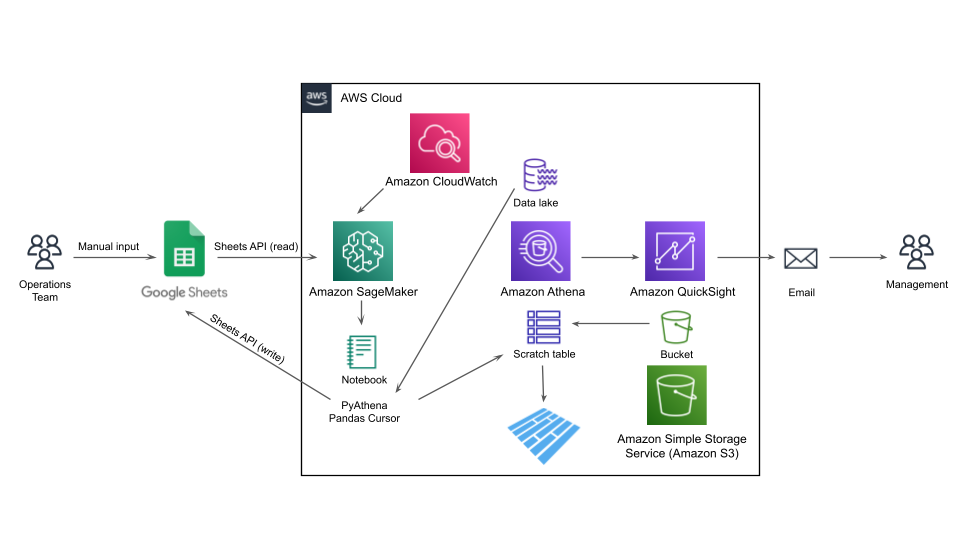

# Google Sheets Ingestion with Change Capture

Self-serve Google Sheets ingestion for analytics: one function turns any
sheet URL into a typed DataFrame, and snapshot diffing turns consecutive
API pulls into an exact insert/update/delete changelog — because the Sheets
API reports state, not changes.

Distilled from a production pipeline that kept an ops team working in their
sheet while analytics got governed, change-aware data in the lake.

## What the Notebook Does

1. **Reads a sheet like an engineer** — OAuth with a cached refresh token
   (one consent, then non-interactive scheduled runs), ragged-row padding,
   and the admission that the API returns strings, always.
2. **Normalizes the spreadsheet away** — header drift, `$98,410.00`
   currency, `TRUE`/`FALSE` checkboxes, cleared-cell empties → stable
   snake_case columns with real dtypes.
3. **Captures changes through the API** — compares snapshot diffing against
   the Drive revisions API and Apps Script triggers, then implements the
   diff: one row hash per record, set arithmetic for inserts, updates, and
   the deletes that append-only pipelines silently lose.
4. **Lands the raw layer and hands off to dbt** — typed Parquet snapshot +
   append-only changelog, then a DuckDB query standing in for the dbt
   staging model. The 2022 original continued into hand-written Athena DDL
   and QuickSight; that part aged out, and the notebook says so.

## Files

- [`gsheets_ingestion.ipynb`](gsheets_ingestion.ipynb) — the analysis,
  executed end-to-end. Live-API cells are guarded, so it runs without
  credentials.
- [`data/snapshot_2022-08-08.csv`](data/snapshot_2022-08-08.csv),
  [`data/snapshot_2022-08-09.csv`](data/snapshot_2022-08-09.csv) —
  **synthetic** consecutive "API pulls" of an anonymized ops outreach
  sheet, with known ground truth: exactly 3 inserts, 2 updates, 1 delete
  between them.
- [`data/generate_snapshots.py`](data/generate_snapshots.py) — the
  generator; every injected sheet-ism and change is documented.

## Original Workflow

The 2022 production automation, as originally diagrammed. The notebook keeps
its two durable ideas (self-serve reads, snapshot-diff change capture) and
hands everything downstream to dbt:



## Run It

```sh
pip install pandas numpy duckdb pyarrow google-api-python-client google-auth-oauthlib jupyter
jupyter notebook gsheets_ingestion.ipynb
```

Runs end-to-end against the bundled snapshots; drop a `client_secret.json`
next to the notebook to point it at a real sheet instead.
