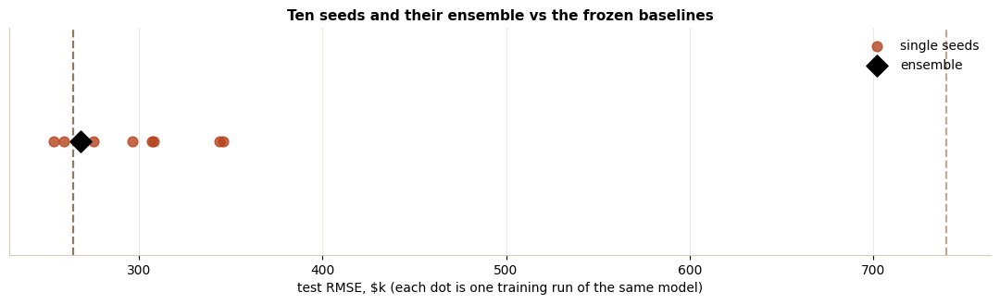
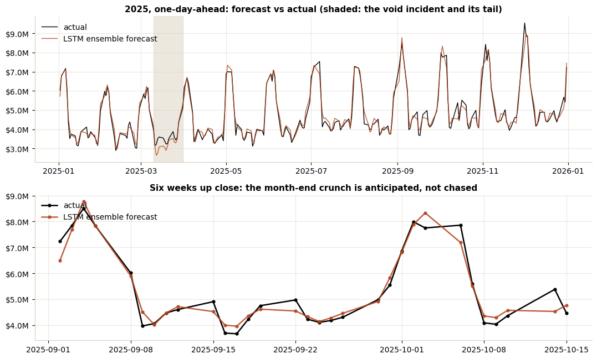

# Forecasting Daily Settled TPV with an LSTM

A virtual card program settles millions of dollars of merchant payments every
business day. Treasury sizes funding lines against tomorrow's settled TPV
(total payment volume), operations staffs against it, and finance paces the
month against plan, today with same-weekday-last-week style heuristics. This
case study builds an LSTM (long short-term memory network) forecaster the way
Jason Brownlee's *Long Short-Term Memory Networks With Python* teaches, and
lets an honest evaluation decide whether it ships.

The verdict is the interesting part: the modeling upgrade cuts the desk
heuristic's error by roughly two thirds, but the LSTM and a linear regression
given the identical 28-day window finish in a statistical tie. The
recommendation is to ship the cheaper model, keep the LSTM harness warm, and
know exactly when depth starts paying. The notebook is written so that
conclusion, and every mechanism behind it, can be explained end to end in a
business review.

## What the Notebook Does

1. **Teaches the model before using it**: what the three LSTM gates (forget,
   input, output) do, why plain RNNs fail on long lags, and what the gates
   mean in payment terms, written to be repeated to end users.
2. **Prepares sequences the book's way**: a 28-business-day sliding window,
   train-only MinMax scaling, the `[samples, timesteps, features]` tensor,
   and a chronological train (2023-2024.09) / validation (2024-Q4) / test
   (all of 2025) split.
3. **Builds the honesty gate**: persistence, seasonal naive, moving average,
   and linear regression on the flattened window. RMSE in dollars, not scaled
   units.
4. **Runs the full Keras lifecycle**: define, compile, fit with early
   stopping and LR reduction, loss-curve diagnostics, vanilla (48 units) vs
   stacked (48-24), then a 10-seed stability study with a prediction
   ensemble, because one lucky training run is not evidence.
5. **Tests its own stories**: an ablation shows the void-rate feature is a
   passenger (incident information already arrives through issuance and
   settlement); a scaler-and-model refit experiment shows a frozen model
   holds up within the year, making refit cadence a monitoring choice.



## Headline Numbers (held-out 2025, one-day-ahead)

| Model | RMSE | MAPE |
|---|---|---|
| Seasonal naive (desk heuristic) | $2,023k | 30.4% |
| Persistence | $740k | 11.0% |
| Linear regression, same window | $264k | 4.4% |
| Vanilla LSTM (48) | $259k | 4.1% |
| LSTM 10-seed ensemble | $268k | 4.4% |
| Seeds range | $254k-$346k | 2/10 beat linear |



## Files

- [`tpv_lstm_forecasting.ipynb`](tpv_lstm_forecasting.ipynb): the analysis,
  executed end-to-end on the bundled data. Keras 3 on the JAX backend; full
  retraining takes about a minute on a laptop CPU (fitted predictions cache
  to a gitignored `artifacts/`; delete it to retrain).
- [`data/daily_payments.csv`](data/daily_payments.csv): **synthetic**,
  deterministic (seed 42). Weekday funding patterns, month-end crunch,
  holidays, program growth, load-dependent settlement lag, and a decaying
  void-rate incident are all injected on purpose and documented in
  [`data/generate_dataset.py`](data/generate_dataset.py).

## Run It

```bash
pip install pandas numpy matplotlib scikit-learn keras jax jupyter
jupyter notebook tpv_lstm_forecasting.ipynb   # runs top to bottom
python data/generate_dataset.py               # rebuilds data/ byte-identically
```

## Durable Ideas

Baselines are the deliverable: the LSTM was built correctly by the book, and
the book's own evaluation discipline (chronological splits, dollar metrics,
repeated runs, ablations) is what concluded the linear model should ship.
The harness is the asset, not the architecture: when the problem moves to
multi-day horizons, intraday grain, or interacting series, the LSTM swaps in
with the features, baselines, and evaluation unchanged. In a modern stack the
refit is a monthly scheduled job, and every refit re-runs the same gate: beat
the baselines on held-out data or stay on the bench.
