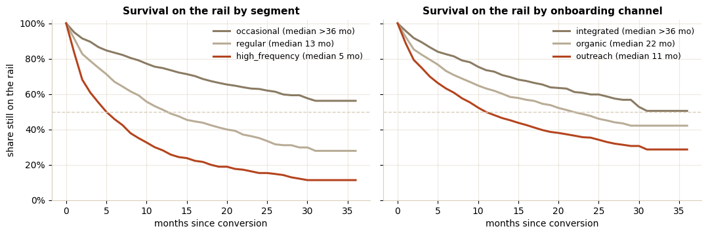
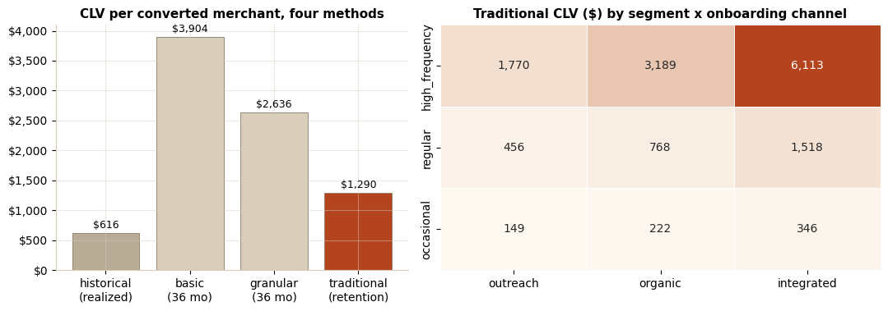

# Customer Lifetime Value for a Check-to-Virtual-Card Program

An accounts payable (AP) automation platform converts merchants from check
and ACH (automated clearing house) onto a virtual card rail and earns
interchange on every settled payment. The companion
[merchant retention study](../merchant_retention/) measures whether the
program is working; this one prices it: how long a converted merchant stays
on the rail, what a convert is worth (customer lifetime value, CLV), and the
most each onboarding channel should spend converting one.

Method follows the CLV chapter of DataCamp's Machine Learning for Marketing
in Python (Karolis Urbonas): cohort retention tables and heatmaps, the
historical, basic, granular, and traditional CLV formulas, and recency,
frequency, monetary (RFM) features feeding a next-month revenue regression
evaluated on held-out data.

## What the Notebook Does

1. **Builds the retention base**: conversion-month cohorts, the retention
   matrix and heatmaps, and Kaplan-Meier survival curves that handle
   censoring, so young cohorts stop masquerading as churn. Median rail
   tenure: 19 months blended, over 36 for integrated converts, 5 for the
   high_frequency segment.
2. **Computes CLV four ways and shows why they disagree**: historical
   (realized, a floor), basic and granular (36-month lifespan, optimistic by
   construction), and traditional (retention-to-churn ratio), which is the
   one fit for spend decisions on a rail where reversion is effectively
   final. Blended traditional CLV: $1,290 against a $3,904 basic estimate.
3. **Prices every segment x channel cell**: traditional CLV from $149
   (occasional merchants converted by paid outreach) to $6,113
   (high_frequency, API-integrated), then divides by fully loaded conversion
   cost to get CLV-to-cost ratios and payback months.
4. **Finds the underwater cell**: outreach conversion of occasional
   merchants returns $149 against $250 of cost. The recommendation is
   routing, not heroics: move that segment to self-serve and point outreach
   at cells with 7-60x returns.
5. **Predicts next-month revenue per merchant** from RFM features with
   linear regression: test RMSE (root mean squared error) $75 vs $91 for a
   "December equals November" benchmark. A statsmodels read then catches the
   multicollinearity trap (frequency and monetary correlate at 0.95, flipping
   a coefficient sign) and fixes it by dropping the redundancy.



## Headline Numbers

| Question | Answer |
|---|---|
| Median rail tenure, blended | 19 months |
| 12-month enrollment retention, integrated vs outreach converts | 72.7% vs 48.1% |
| Traditional CLV, blended | $1,290 |
| CLV range across segment x channel cells | $149 to $6,113 |
| Value-destroying cell | occasional x outreach ($149 CLV vs $250 cost) |
| Next-month revenue model vs naive benchmark, test RMSE | $75 vs $91 |



## Files

- [`virtual_card_clv.ipynb`](virtual_card_clv.ipynb): the analysis, executed
  end-to-end on the bundled data. No credentials or network needed.
- [`data/merchants.csv`](data/merchants.csv),
  [`data/vc_payments.csv`](data/vc_payments.csv): **synthetic**,
  deterministic (seed 42). Segment-dependent churn hazards, the early-tenure
  hazard shock, channel and prior-rail effects, the 2024 campaign cohorts,
  and seasonality are all injected on purpose and documented in
  [`data/generate_dataset.py`](data/generate_dataset.py).

## Run It

```bash
pip install pandas numpy matplotlib seaborn scikit-learn statsmodels jupyter
jupyter notebook virtual_card_clv.ipynb   # runs top to bottom
python data/generate_dataset.py           # rebuilds data/ byte-identically
```

## Durable Ideas

The formulas are arithmetic; the judgment is in the bases. Per-enrolled-month
revenue instead of per-active-month (occasional merchants keep the rail but
skip months), month-over-month retention instead of averaging a cumulative
cohort matrix, and a behavior-derived segment label kept out of the feature
set (label leakage that inflates R-squared while killing every honest
coefficient). In a modern stack the marts feeding this analysis would be dbt
models over the enrollment history, with CLV refreshed monthly and the
spend-ceiling table landing in the finance review deck unchanged.
